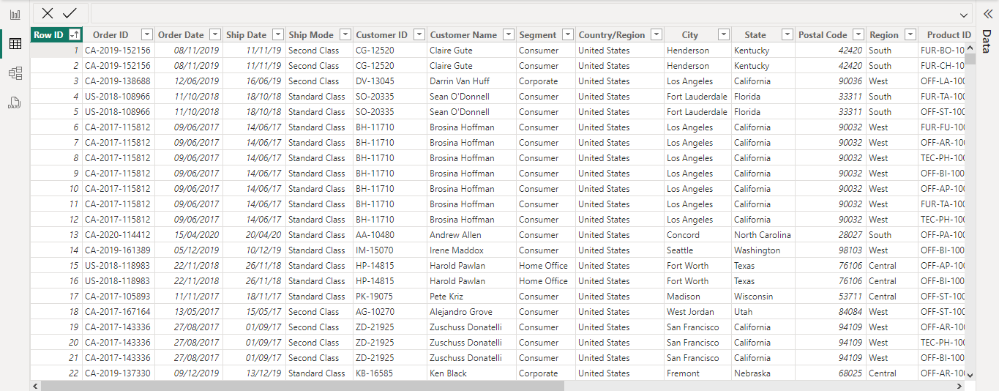
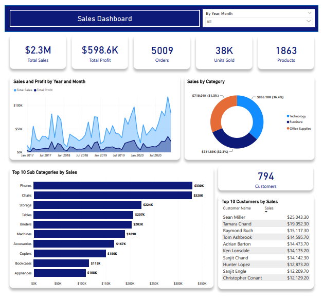

# Superstore Sales Dashboard

## Project Overview
The Superstore Sales Dashboard, created using Power BI, is crafted to offer a detailed and interactive perspective on the sales performance of a retail superstore. 
This dashboard functions as an all-in-one solution for monitoring, analyzing, and extracting meaningful insights from sales data. 
Its main objective is to enable the retail management team to make informed, data-driven decisions and refine their sales strategies effectively. 
In essence, the project's goal is to conduct a thorough sales performance analysis for the store.

## Dataset Overview
To build this Superstore Sales Dashboard, I leveraged a comprehensive dataset containing historical sales data.

    

This dataset includes 9,994 entries and 21 columns, encompassing a range of details such as:
- **Order Information**: Row ID, Order ID, Order Date, Ship Date, and Ship Mode
- **Customer Details**: Customer ID, Customer Name, and Segment
- **Geographical Data**: Country/Region, City, State, Postal Code, and Region
- **Product Information**: Product ID, Category, Sub-Category, and Product Name
- **Sales Metrics**: Sales, Quantity, Discount, and Profit

## Sales Dashboard

    

## Summary
The Superstore Sales Dashboard in Power BI is an interactive tool that goes beyond a static report. It allows users to drill down into the data, apply filters, and explore insights in real-time.
